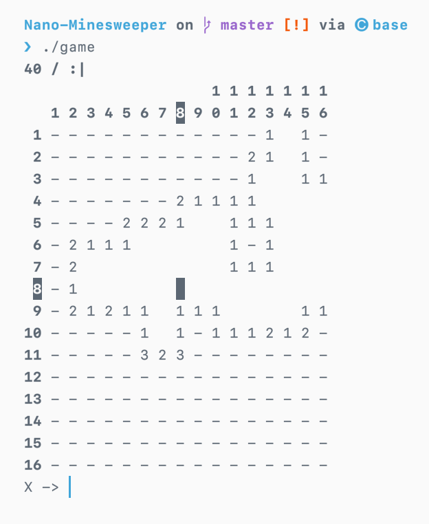

## Nano-Minesweeper

A lighter version of a command line minesweeper [game](https://github.com/spinks/MineSweeper).

Build with `make` run with `./game`.

### Arguments

The game now takes command line arguments allowing for custom games, or traditional difficulty levels:

- Custom Game
	- `./game rows cols mines`
	- Where rows, cols, mines are ints
	- rows > 0 && cols > 0
	- mines < (rows*cols)
- Difficulty levels
	- `./game difficulty`
	- Where difficulty is a string
	- **"easy"** or **"e"** for 9 by 9 grid with 10 mines
	- **"hard"** or **"h"** for 30 by 16 grid with 99 mines
	- **"int"** or **"i"** (or anything else as this is the fallback standard game) for 16 by 16 grid with 40 mines
- Standard
	- `./game`
	- For 16 by 16 grid with 40 mines

Requires C++11.

### Gameplay

- You will first be prompted to move the x and y values of the cursor.
	- An **int** will move the cursor to that column(x)/row(y)
	- An **empty input (enter)** will keep the same column/row (allowing you to quickly move cursor in only one direction)
	- A **'c'** will cancel the current action (if you mistyped one of the coordinates)
- Then you will be prompted for an action
	- A **'f'** will flag or un-flag the current cursor location
	- A **'c'** will cancel the current action (returning to cursor movement)
	- Anything else (**empty input (enter)**, 'r', etc.) will reveal the current square

